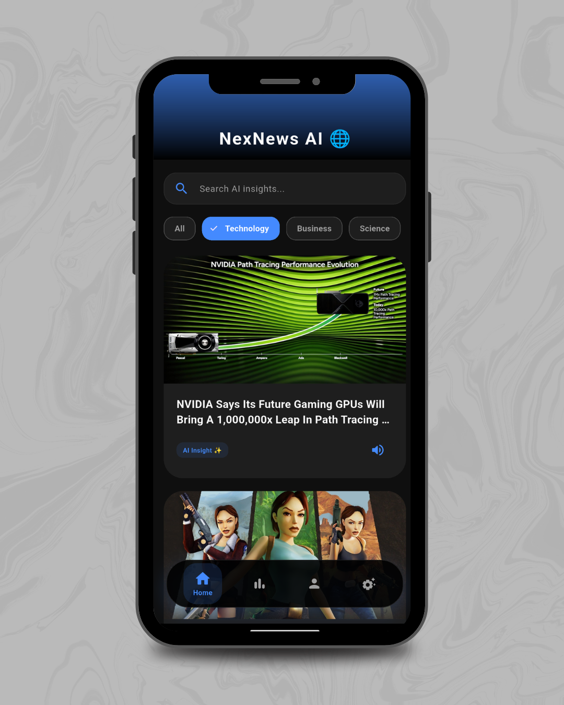
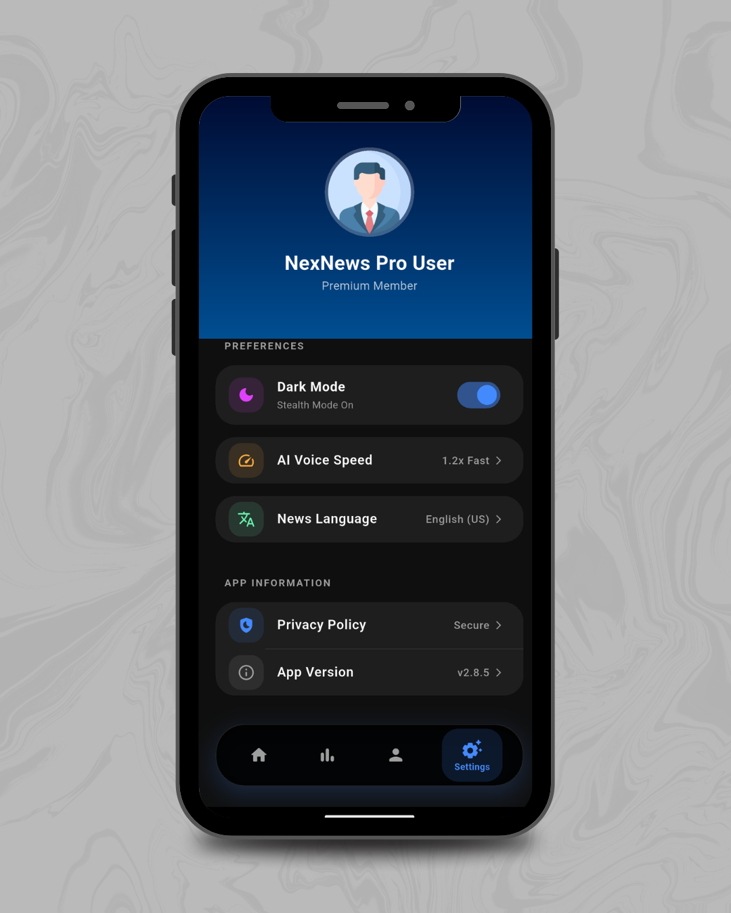
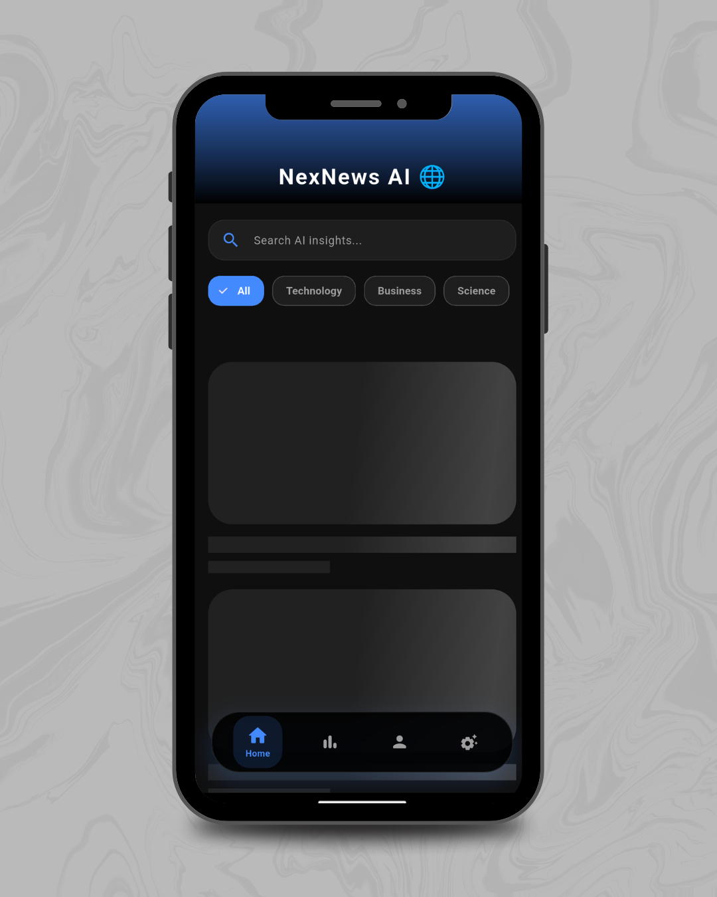

# NexNews AI 🌐
A Premium AI-powered News Application that brings global headlines with smart summaries and voice insights.

## ✨ Experience the Vibe (Light vs Dark)

  

## 🔍 Key App Modules

  
  
  

---

## 🚀 Why NexNews AI?
- **🧠 AI Summary:** One-tap AI insights for busy readers using Gemini/GPT logic.
- **🔊 Voice Headlines:** Listen to the news while you commute with built-in TTS.
- **⚡ Pro UI/UX:** Shimmer effects for loading states and fluid transitions.
- **🌗 Theme Flexible:** Fully optimized for both Dark and Light modes.

## 🛠️ Tech Stack
- **Framework:** Flutter (Dart)
- **API:** NewsAPI
- **State Management:** Local State / Stateful UI

## ⚙️ Installation
1. Clone: `git clone https://github.com/haseeb0123/nex_news_ai.git`
2. Packages: `flutter pub get`
3. Run: `flutter run`
